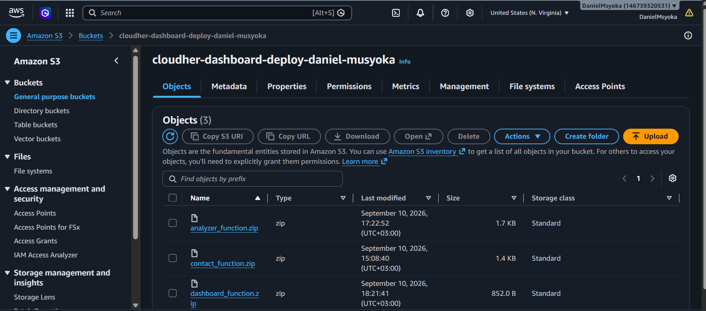
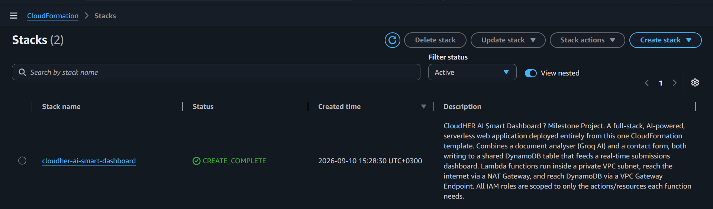
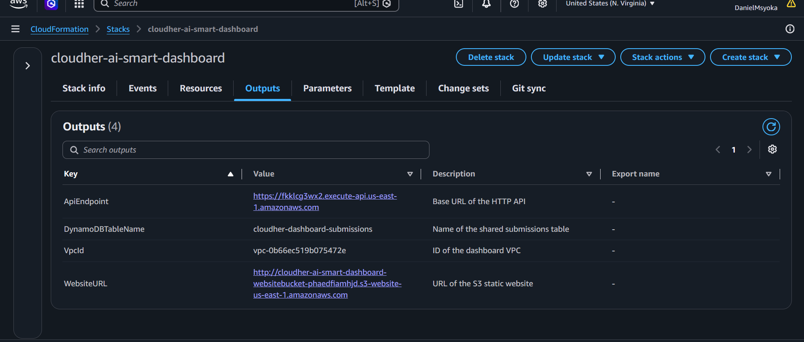
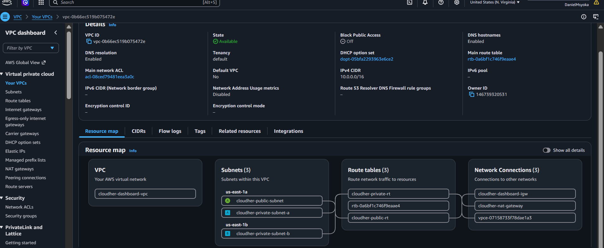
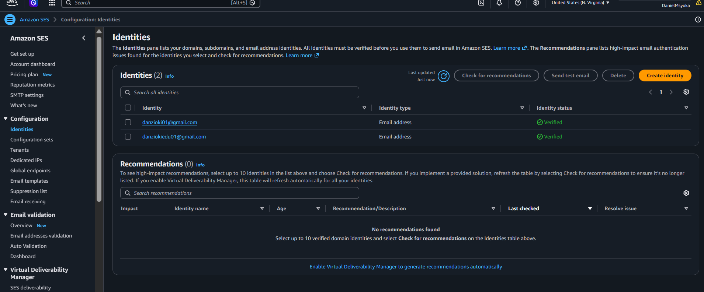
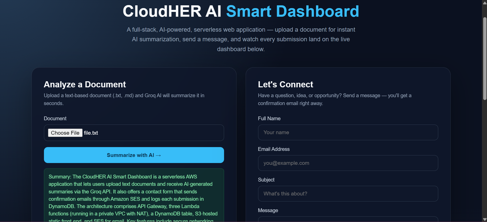
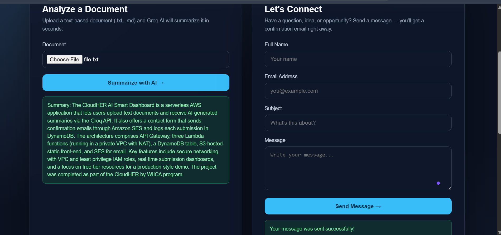
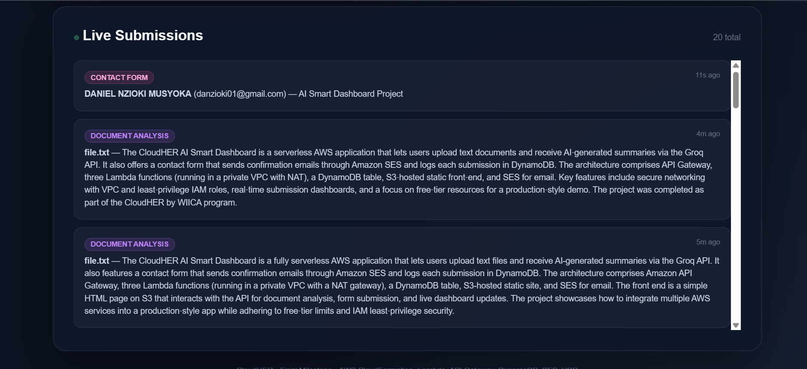
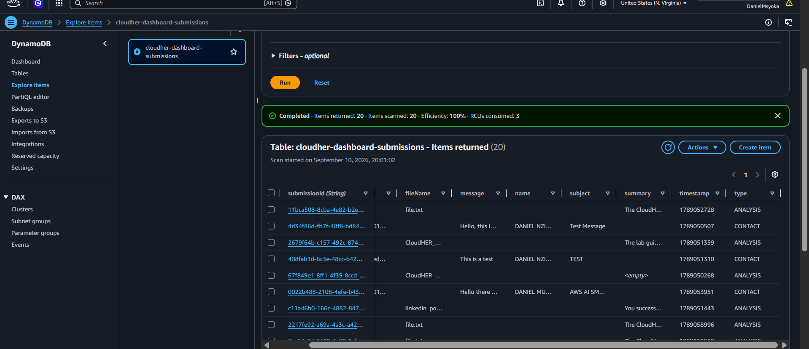
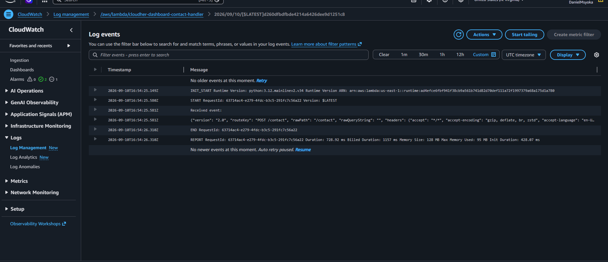

# CloudHER AI Smart Dashboard

<p align="center">
  <strong>CloudHER by WIICA — Final Capstone Project</strong><br>
  <em>Serverless AI Document Analysis + Contact Form + Live Dashboard</em>
</p>

<p align="center">
  
  
  
  
  
</p>

<p align="center">
  🔗 <strong><a href="http://cloudher-ai-smart-dashboard-websitebucket-phaedfiamhjd.s3-website-us-east-1.amazonaws.com/">View the Live Demo</a></strong>
</p>

---

## Table of Contents

- [Overview](#overview)
- [Live Demo](#live-demo)
- [Architecture](#architecture)
- [Features](#features)
- [Tech Stack](#tech-stack)
- [Prerequisites](#prerequisites)
- [Project Structure](#project-structure)
- [How I Built This (Step by Step)](#how-i-built-this-step-by-step)
- [How the Application Works](#how-the-application-works)
- [Troubleshooting Notes](#troubleshooting-notes)
- [Screenshots](#screenshots)
- [Deliverables Checklist](#deliverables-checklist)
- [Skills Demonstrated](#skills-demonstrated)
- [What I Learned](#what-i-learned)
- [Cleanup](#cleanup)
- [Author](#author)
- [Acknowledgements](#acknowledgements)
- [License](#license)

---

## Overview

This is the **final capstone project** for the CloudHER by WIICA mentorship program.

The **CloudHER AI Smart Dashboard** is a fully serverless web application that lets anyone:

1. Upload a text document and get an AI-generated summary (powered by Groq)
2. Send a contact message and receive an automatic confirmation email
3. Watch every submission appear in real time on a live dashboard

Everything you see below — every AWS resource, every permission, every network rule — is created from **one single CloudFormation template**. There is no manual clicking-around in the console to set things up; the whole infrastructure is defined as code.

---

## Live Demo

You can try the deployed application right now, no setup required:

**🔗 [http://cloudher-ai-smart-dashboard-websitebucket-phaedfiamhjd.s3-website-us-east-1.amazonaws.com/](http://cloudher-ai-smart-dashboard-websitebucket-phaedfiamhjd.s3-website-us-east-1.amazonaws.com/)**

Try it out:
- Upload a `.txt` or `.md` file and watch Groq AI summarize it in seconds
- Fill out the contact form and check your inbox for a confirmation email
- Watch the "Live Submissions" panel update automatically with what you just did

> **Note:** Amazon SES is currently in "sandbox mode" on this account, so confirmation emails will only successfully deliver to addresses that have been manually verified. See [SES Sandbox restriction](#4-ses-sandbox-restriction) below.

---

## Architecture

```
                        Internet
                           │
                    Amazon API Gateway
                           │
        ┌──────────────────┼──────────────────┐
        │                  │                  │
   POST /analyze     POST /contact      GET /submissions
        │                  │                  │
        ▼                  ▼                  ▼
┌───────────────┐  ┌───────────────┐  ┌───────────────┐
│ Analyzer      │  │ Contact       │  │ Dashboard     │
│ Lambda        │  │ Lambda        │  │ Lambda        │
│ (Groq AI)     │  │ (SES + DB)    │  │ (Scan table)  │
└───────┬───────┘  └───────┬───────┘  └───────┬───────┘
        │                  │                  │
        └──────────────────┼──────────────────┘
                           │
                    DynamoDB Table
               (cloudher-dashboard-submissions)
                           │
                    S3 Static Website
               (index.html + error.html)
```

All three Lambda functions run inside **private subnets** and reach the internet through a **NAT Gateway**. DynamoDB traffic stays private via a VPC Gateway Endpoint — it never touches the public internet.

---

## Features

| Feature | Description |
|---------|-------------|
| **AI Document Summarizer** | Upload `.txt` / `.md` files → Groq AI returns a concise summary |
| **Contact Form** | Sends a confirmation email to the visitor + a notification email to the owner, via Amazon SES |
| **Live Submissions Dashboard** | Refreshes automatically and shows every analysis + contact message as it happens |
| **Serverless Architecture** | No servers to manage — everything is event-driven |
| **Infrastructure as Code** | The entire stack deploys from one CloudFormation template |
| **Secure Networking** | Lambdas run in private subnets; every IAM role is scoped to only what it needs |

---

## Tech Stack

- **Frontend**: HTML, CSS, Vanilla JavaScript
- **Backend**: AWS Lambda (Python 3.12)
- **API**: Amazon API Gateway (HTTP API)
- **Database**: Amazon DynamoDB
- **Email**: Amazon SES
- **AI**: Groq API
- **Infrastructure**: AWS CloudFormation
- **Networking**: VPC, Private Subnets, NAT Gateway, VPC Endpoints
- **Storage**: Amazon S3 (static website hosting)

---

## Prerequisites

- An AWS account
- The AWS CLI configured (or just the AWS Console — either works)
- A free Groq API key ([console.groq.com](https://console.groq.com))
- At least one email address verified in Amazon SES
- No prior AWS experience required to follow the steps below

---

## Project Structure

```text
cloudher-ai-smart-dashboard/
│
├── Infrastructure/
│   └── main-template.yaml          # The full CloudFormation stack (everything is built from this one file)
│
├── Lambda/
│   ├── analyzer_handler.py         # Calls Groq AI to summarize documents
│   ├── contact_handler.py          # Saves messages to DynamoDB + sends SES emails
│   ├── dashboard_handler.py        # Reads DynamoDB for the live dashboard
│   ├── analyzer_function.zip
│   ├── contact_function.zip
│   └── dashboard_function.zip
│
├── Website/
│   ├── index.html                  # The main page (upload, contact form, live dashboard)
│   └── error.html
│
├── scripts/
│   └── package_lambdas.sh          # Helper script that zips and uploads the Lambda code
│
├── Screenshots/                    # Visual proof the project actually works (see below)
│
├── README.md
├── .gitignore
└── LICENSE
```

---

## How I Built This (Step by Step)

This section walks through exactly how the project came together, in the order I actually did it — useful if you want to rebuild this yourself or just understand what each piece is for.

### Step 1 — Design the combined architecture

The milestone required merging a "File Analyser" and a "Contact Form" into one project. I designed one shared DynamoDB table that both features write to, so a single live dashboard could show all of it in one place, instead of building two disconnected apps.

### Step 2 — Write the CloudFormation template

Everything — the VPC, the S3 website bucket, the DynamoDB table, all three Lambda functions, the API Gateway routes, the IAM roles, and the CloudWatch alarms — lives in `Infrastructure/main-template.yaml`. Writing it as one template means the whole project can be torn down and rebuilt with two commands, instead of dozens of manual console clicks.

### Step 3 — Write the three Lambda functions

- `analyzer_handler.py` reads the uploaded document text and asks Groq AI to summarize it
- `contact_handler.py` saves the contact form's message to DynamoDB and sends two emails through SES
- `dashboard_handler.py` reads everything back out of DynamoDB for the live feed

### Step 4 — Create an S3 bucket for the Lambda code

CloudFormation needs the Lambda code sitting in S3 *before* it can deploy, so I created a small bucket (`cloudher-dashboard-deploy-daniel-musyoka`) just to hold the three zip files.

**📸 Screenshot 1** shows this bucket with all three zips uploaded.

### Step 5 — Get a Groq API key

The Analyzer Lambda needs an API key to call Groq's AI service. I created a free account at [console.groq.com](https://console.groq.com) and generated a key under **API Keys**.

### Step 6 — Package and upload the Lambda functions

Each Lambda handler gets zipped up and uploaded to the S3 bucket from Step 4, using either the provided script or manually zipping each `.py` file and uploading through the S3 console.

### Step 7 — Deploy the CloudFormation stack

With the Lambda code in S3 and a Groq key in hand, I deployed the stack through the CloudFormation console: uploaded `main-template.yaml`, filled in the parameters (bucket name, Groq key, sender/recipient email), acknowledged the IAM capability warning, and hit Submit.

**📸 Screenshot 2** shows the stack reaching `CREATE_COMPLETE`.
**📸 Screenshot 3** shows the Outputs tab with the live URLs.
**📸 Screenshot 4** shows the VPC that got created — private subnets, NAT Gateway, and all.

> **Note:** The first attempt failed validation because a Lambda function name from an earlier project (Week 8) was already in use. The fix was renaming the conflicting resources in the template (`cloudher-contact-form-handler` → `cloudher-dashboard-contact-handler`) so the new stack could exist independently alongside the old one.

### Step 8 — Verify email addresses in SES

Amazon SES blocks sending email to unverified addresses by default. I verified both the sender and recipient addresses in **SES → Verified identities**.

**📸 Screenshot 5** shows both addresses verified.

### Step 9 — Connect the frontend to the live API

Once the stack was deployed, I copied the `ApiEndpoint` value from the Outputs tab and pasted it into `Website/index.html`, then uploaded `index.html` and `error.html` to the website bucket the stack created.

### Step 10 — Test everything end-to-end

**📸 Screenshots 6a–6c** show the live site: a document being summarized, a contact form submission succeeding, and both showing up on the live dashboard.
**📸 Screenshot 7** shows both submission types sitting in the DynamoDB table.
**📸 Screenshot 8** shows a clean Lambda execution in CloudWatch Logs, with no errors.

---

## How the Application Works

1. A visitor uploads a document on the website
2. The frontend sends the text to `POST /analyze`
3. The Analyzer Lambda calls Groq AI and saves the summary to DynamoDB
4. A visitor fills out the contact form → `POST /contact`
5. The Contact Lambda saves the message and sends two emails via SES (one to the visitor, one to the site owner)
6. The live dashboard calls `GET /submissions` every few seconds and displays everything as it comes in

---

## Troubleshooting Notes

### 1. AI Analysis returned "The AI analysis service returned an error"
**Cause:** Groq blocked the request because of the default Python `User-Agent`.
**Fix:** Added a custom `User-Agent` header in `analyzer_handler.py`.

### 2. Contact form failed with AccessDenied on `ses:SendEmail`
**Cause:** The IAM role only allowed one specific verified email identity.
**Fix:** Updated the role's policy to permit `ses:SendEmail`.

### 3. Live dashboard stuck on "Loading submissions…"
**Cause:** DynamoDB returns numbers as `Decimal`, which Python's `json.dumps` can't serialize by default.
**Fix:** Added a custom JSON encoder in `dashboard_handler.py`.

### 4. SES Sandbox restriction
While the AWS account is in SES sandbox mode, emails can only be sent to addresses that have been manually verified. Requesting SES production access (a free AWS support request) would let the app send confirmation emails to any visitor.

---

## Screenshots

All screenshots below are stored in [`Screenshots/`](./Screenshots) and are numbered in the order they happened during the build.

| # | What it shows |
|---|---|
|  | **01 — Lambda deployment bucket.** All three Lambda zip files uploaded and ready before deploying the stack. |
|  | **02 — Stack CREATE_COMPLETE.** The full CloudFormation stack — all 45 resources — deployed successfully. |
|  | **03 — Stack Outputs.** The live WebsiteURL, ApiEndpoint, DynamoDB table name, and VPC ID produced by the deployment. |
|  | **04 — VPC resource map.** Private subnets, NAT Gateway, and routing, all created automatically by the template. |
|  | **05 — SES verified identities.** Both email addresses verified and ready to send/receive. |
|  | **06a — Document analysis in action.** A real document uploaded and summarized by Groq AI. |
|  | **06b — Contact form success.** A message submitted through the live site. |
|  | **06c — Live dashboard.** Both submission types appearing together in real time. |
|  | **07 — DynamoDB table.** Real analysis and contact records stored side by side. |
|  | **08 — CloudWatch Logs.** A clean Lambda execution with no errors. |

---

## Deliverables Checklist

- [x] Full CloudFormation template
- [x] Three working Lambda functions
- [x] S3 static website
- [x] AI document summarization working
- [x] Contact form + SES emails working
- [x] Live submissions dashboard working
- [x] VPC with private subnets + NAT Gateway
- [x] Least-privilege IAM roles
- [x] Screenshots of the running application
- [x] Clean, documented GitHub repository

---

## Skills Demonstrated

- Infrastructure as Code with CloudFormation
- Serverless architecture (Lambda + API Gateway)
- Secure networking (VPC, private subnets, NAT Gateway, VPC Endpoints)
- DynamoDB design and querying
- Amazon SES integration
- Third-party AI API integration (Groq)
- Frontend ↔ backend communication
- Debugging with CloudWatch Logs
- IAM least-privilege policies
- End-to-end project delivery

---

## What I Learned

- How to design a complete serverless application from scratch
- Why Lambdas in private subnets need a NAT Gateway for outbound internet access
- How DynamoDB's `Decimal` type breaks normal JSON serialization
- How third-party APIs like Groq can block requests based on `User-Agent`
- The importance of reading CloudWatch logs instead of guessing
- How SES sandbox mode affects real-world testing
- How to structure a professional final project repository

---

## Cleanup

To avoid ongoing AWS charges:

```bash
aws cloudformation delete-stack --stack-name cloudher-ai-smart-dashboard
```

Also remember to delete:
- The Lambda deployment S3 bucket
- Any leftover NAT Gateway or Elastic IP, if the stack doesn't remove them automatically

---

## Author

**Daniel Nzioki Musyoka**

[](https://github.com/Daniel059)
[](https://www.linkedin.com/in/daniel-nzioki-musyoka)

---

## Acknowledgements

This project was completed as the **final milestone** of the **CloudHER by WIICA** mentorship program.

Special thanks to:
- **Rajpreet Gill** — Mentor
- **Paula Ali Wakabi (Miss. Cloud)** — Founder, WIICA
- Women Innovating in Cloud Africa (WIICA)

---

## License

This project is intended for educational and portfolio purposes. See [LICENSE](./LICENSE) for details.